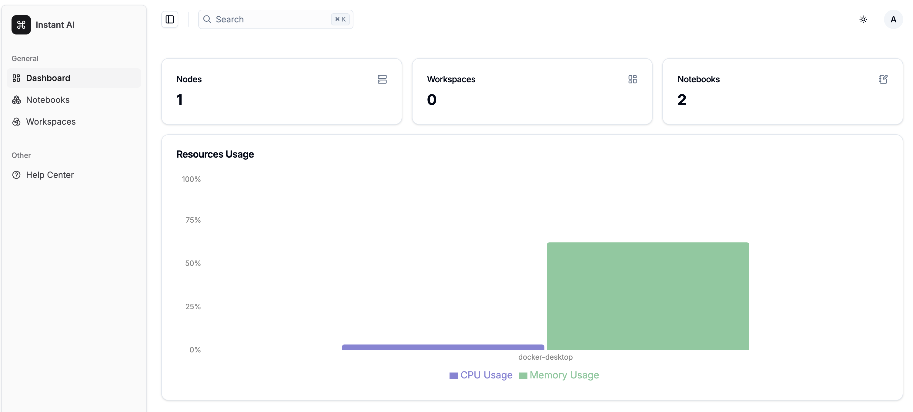

# InstantAI

[English](../README.md) | [中文](#chinese)

<a name="chinese"></a>
# InstantAI - 轻量级AI训练平台

InstantAI 是一个基于 Kubernetes 的轻量级 AI 训练和机器学习平台，旨在作为 Kubeflow 的替代方案。它为企业环境中的 AI 开发和部署提供了一个精简的解决方案。



> ⚠️ **注意**：该项目目前正在积极开发中。现阶段不建议在生产环境中使用。

## 主要特性

- **轻量级架构**：单一核心组件设计，一键安装
- **企业级安全**：使用 Keycloak 进行完整的权限控制和认证授权
- **空间级授权**：支持对单个工作空间进行细粒度的访问控制
- **Jupyter Notebooks**：集成在 Kubernetes 环境中运行的 Jupyter，用于开发和调试
- **简洁的 UI**：清晰直观的用户界面，实现高效管理

## 快速开始

### 环境要求

推荐使用以下版本（其他版本可能也可以工作，但未经测试）：

- Kubernetes 1.31+
- Keycloak 25.2
- PostgreSQL 17

### 准备工作

1. 创建名为 `instantai` 的数据库并设置授权用户凭据
2. 申请域名和 SSL 证书（前端和后端需要不同的域名）

### 安装步骤

1. 准备后端配置文件 `values-backend.yaml`：
```yaml
ingress:
  enabled: true
config:
  database:
    host: localhost
    port: 30000
    name: instantai-api
    username: instantai
    password: instantai
  keycloak:
    baseUrl: https://keycloak.instant.ai
    realm: master
    client:
      id: instantai
      secret: c0VqkTiSUIMhSn8D4tlgKHC5UZAGZOjY
      name: litetest
      redirectUri: "{baseUrl}/login/oauth2/code/{registrationId}"
      scope: openid, profile, email
      grantType: authorization_code
```

2. 准备前端配置文件 `values-front.yaml`：
```yaml
env:
  VITE_KEYCLOAK_URL: "https://keycloak.instant.ai"
  VITE_KEYCLOAK_REALM: "master"
  VITE_KEYCLOAK_CLIENT: "instantai-web"
  VITE_BACKEND_URL: "https://lab.instant.ai"
```

3. 使用 Helm 安装：
```bash
# 安装后端
helm -n cloud upgrade instantai-api -f values-backend.yaml oci://ghcr.io/instantai/charts/instantai-api

# 安装前端
helm -n cloud upgrade instantai oci://ghcr.io/instantai/charts/instantai -f values-front.yaml
```

4. 访问平台：https://console.instant.ai/ 